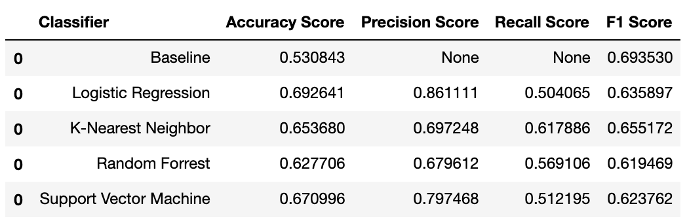

# Diagnosing  Diabetic Retinopathy

   ### Contributors:
   
   __Marissa Eppes & Melissa Rodriguez__

## Summary
 
 We are testing the different Supervised Machine Learning Classification Algortihms in order to diagnose Diabetic Retinopathy.

 The following algorithms were tested:
 
    * Logistic Regression
    * KNN
    * Random Forrest
    * SVM

## Files:
    
   * Technical Notebook
   * messidor_features.arff

## Dataset

   * [UCI Machine Learning Datasets Repository](https://archive.ics.uci.edu/ml/datasets/Diabetic+Retinopathy+Debrecen+Data+Set)
   * 20 Attributes
   * 1151 observations
   * Features extracted from the Messidor image set to predict whether an image contains signs of diabetic retinopathy or not.

## Scores for each Classification Algorithms tested

